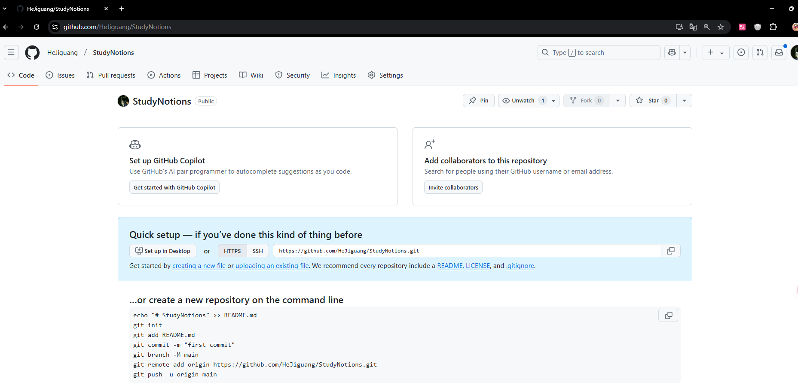
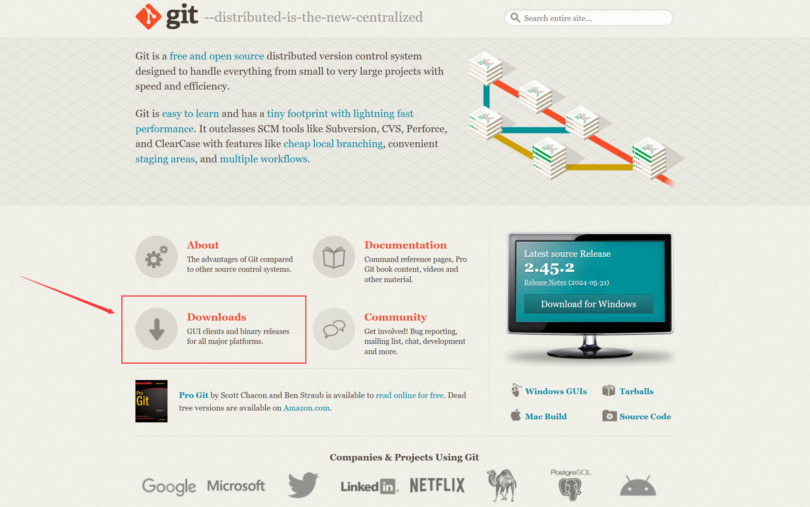
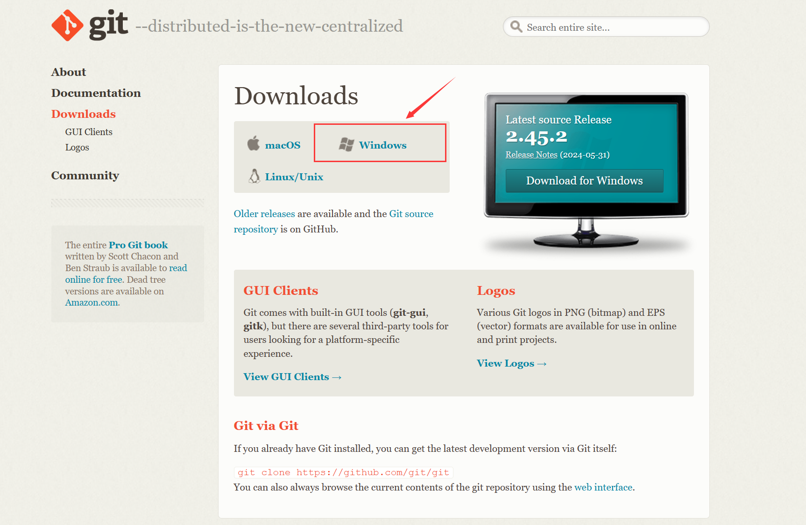

# GitHub学习使用

前言：Git确实是一个十分重要的工具，是一位合格的程序员必须掌握的工具。打算未来将自己写的每一份代码同步到git仓库，记录自己的学习与成长。这里是一份系统学习git与github的使用笔记。

新手写博客文章最简单的方法是什么呢？抄袭？不不不，那叫借鉴，哈哈哈，感谢原文作者：[Github入门教程，适合新手学习（非常详细）](https://blog.csdn.net/black_sneak/article/details/139600633)

## 1.git简介

### Git的产生

Linus在1991年创建开源了linux，随着linux的不断发展，有越来越多的人参与到了linux的社区中，许多人为linux系统添砖加瓦，起初的时候是志愿者将源文件通过diff的方式发送给linus，之后由linus手动合成代码。

随着社区的发展，十年之后，也就是2002年。代码库变得十分庞大，让linus手动管理变得很困难，起初是选择一共商业版的版本控制器BitKeeper，这个版本控制器的东家还授权linux社区免费使用这个版本控制器。

三年后，2005年，linus打破了这个美好的局面，用了两周的时间用C语言写了Git，一共分布式的版本控制器。一个月之内，linux系统的源码便被转移到了Git管理了。

没错，git是linux之父用两周时间用C语言创造出改变世界的东西。

Linux和linus的故事还是很有吸引力的，有时间可以去研究研究。

## Git与GitHub的关系

Git是一个分布式版本控制系统，用来跟踪代码的变化，并允许多个开发者在不同的时间和地点对同一个项目进行修改。Git的核心功能是管理代码的版本历史，确保代码的不同版本能够轻松地合并和回退。

GitHub则是一个基于Git的在线代码托管平台。它提供了Git的功能，并将其扩展为一个云端服务，允许开发者将本地的Git仓库托管到云端，方便团队协作、代码分享以及管理项目的进度。GitHub还提供了额外的功能，如问题跟踪、代码审查、wiki和项目管理工具。

总结来说，Git是一个工具，GitHub是一个平台。GitHub使用Git来管理和版本控制代码，同时为开发者提供云端的协作和社交功能。

## GitHub使用

### GitHub注册登录

进入GitHub官网，在官网中注册登录自己的github账号。

### GitHub项目库创建

1. 登录自己的GitHub，点击创建。
2. 填写自己项目信息：

3. 完成项目创建：

在创建完成自己的库之后，下面就要让自己的电脑克隆一个自己所创建的库，方面自己电脑上的代码同步到 GitHub 你所创建的库当中。为了实现，就需要安装一个软件 Git Bash。接下来让我们安装 Git Bash。 

## Gitbash安装详解

Git Bash 是一个为 Windows 提供的 Bash 命令行环境，它允许用户使用 Git 命令，同时支持 Linux/Unix 风格的 Shell 命令。它由 Git for Windows 提供，是 Windows 上常用的 Git 工具之一。

Git Bash 的特点:

- 支持 Git 命令：可以使用 git clone、git commit、git push 等标准 Git 命令。
- 支持 Bash 命令：可以使用 ls、pwd、cd、rm 等 Linux 终端命令，比 Windows 命令提示符（CMD）更强大。
- 基于 MinGW64：Git Bash 依赖 MinGW（Minimalist GNU for Windows）和 MSYS（Minimal System），提供 Unix 风格的环境，但并非完整的 Linux 终端。
- 可运行 Shell 脚本：支持 .sh 脚本运行，适合自动化任务。

Git官网下载地址:Git (git-scm.com)

在 Git 的官网中点击Downloads。

选择自己的操作系统下载即可。

等待下载完成。

## Git与Github的绑定

Git可以绑定到Github，Github在国外，需要科学上网的工具。也可以绑定到Gitee。详细教程可见：
https://www.cnblogs.com/ttmaoxianjun/articles/14617125.html

## 使用Git将代码提交到GitHub

使用Git将代码提交到Github上，主要会使用到两个push和pull 

首先在github上建立仓库。

其次在本地建立项目文件夹A。

之后在文件夹中通过gitbush，用下面命令将github项目克隆到本地。`git clone 地址`

该过程有时候需要收入github的账号密码之类的。

### 上传代码

在打开的文件夹中建立文件。

后在文件夹中通过右键进入gitbush页面。

之后使用`git add 文件名称`在git中添加新的文件。

然后使用`git commit 注释`为本次更新添加备注，方便查找记忆。

接着输入`git push origin main`将添加内容更新，就代表成功了。

