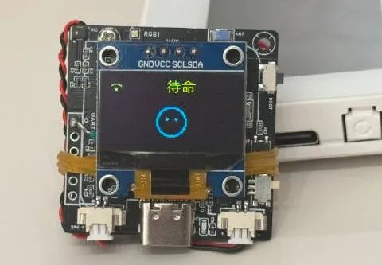
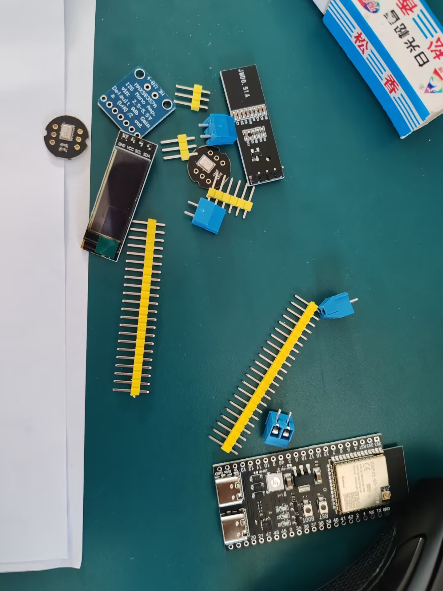
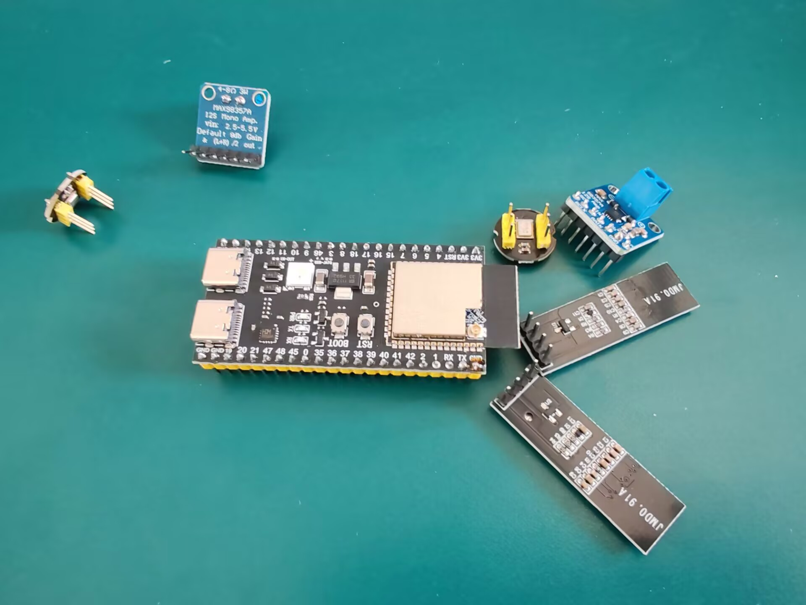
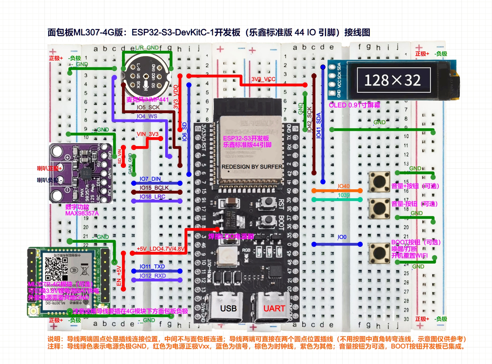
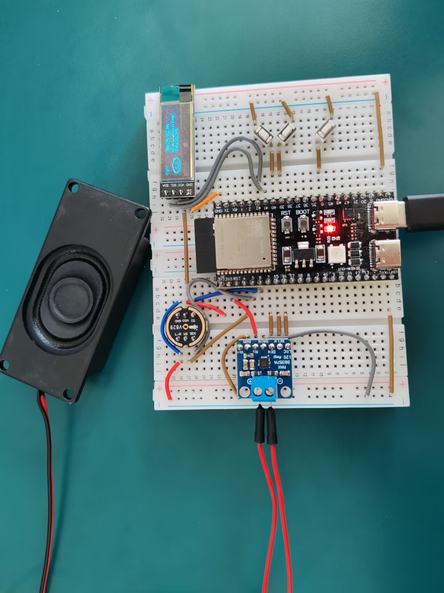

# 小智机器人学习制作教程

前言：

之前看海绵宝宝，觉得痞老板的老婆卡伦·普兰克顿离我们很遥远。

这两天看到有人用esp32搭建的小智机器人，这个台湾腔的女生甚是讨人喜欢。

.webp)

质疑痞老板，理解痞老板，下一步自然是成为痞老板。接着找到了大佬的开源项目，试着学习学习。
这里是开源项目的原地址：
https://github.com/78/xiaozhi-esp32

## 硬件平台搭建

首先是硬件平台的搭建，原来的项目有多个版本，我们在搭建的时候选用面包板和esp32S3上部署的wifi版本，相对成本较低，过程简单。如果感兴趣可以看看小智团队开源的其他版本，比如下面这个：
https://oshwhub.com/tenclass01/xmini_c3

有时间可以学习学习。

### 硬件清单：

- 开发板：ESP32-S3-DevKitC-1（选择 WROOM N16R8 模组）
- 数字麦克风：INMP441
- 功放：MAX98357A
- 腔体喇叭：8Ω 2~3W  或 4Ω 2~3W 
- 导线：跳线一盒，杜邦线若干
- 400 孔面包板 2 块
- 128x32 I2C(IIC) 液晶显示屏，SSD1306 驱动（推荐）
- 6*6mm 立式 轻触开关（可选）

### 硬件购买

我自己有一些杜邦线跳线与几块面包板，在淘宝购买。合计成本六十左右,有几个模块是未焊接版本，如果不会锡焊的话最好购买焊接好的硬件。也可以在淘宝买成品，大致在八十到九十左右。

### 平台搭建

首先是需要将需要焊接好的硬件进行焊接。

原理图：

之后就是按照原理图将其进行组装，我组装了两个，大家可以参考。

当然，也可以选择绘制一块PCB帮助理线，或者在咸鱼上可以找到别人绘制的PCB，可以购买使用。

## 软件烧录与网络配置

烧录的过程项目原团队制作的详细的教程：

https://ccnphfhqs21z.feishu.cn/wiki/Zpz4wXBtdimBrLk25WdcXzxcnNS

我使用的是Flash软件电脑上烧录（无 IDF 开发环境）方法。

烧录完成后，重新通电或者按BOOT按钮，会发出声音，如果正常发出需要配网的声音，说明烧录完成了。

烧录完成之后，需要先连接esp32打开的热点，连接后为其配置wifi。esp32的wifi只能用2.4G，不能连接5G。如果是手机热点的话需要将其变为2.4G的网络。

网络配置可见教程：https://ccnphfhqs21z.feishu.cn/wiki/KGvIwjTQxiTxPCkRbbjcPnsLnMb

可以在其提供的后台程序中配置自己聊天的智能体。

智能体配置后台：
https://xiaozhi.me/console/agents

## 源码学习分析