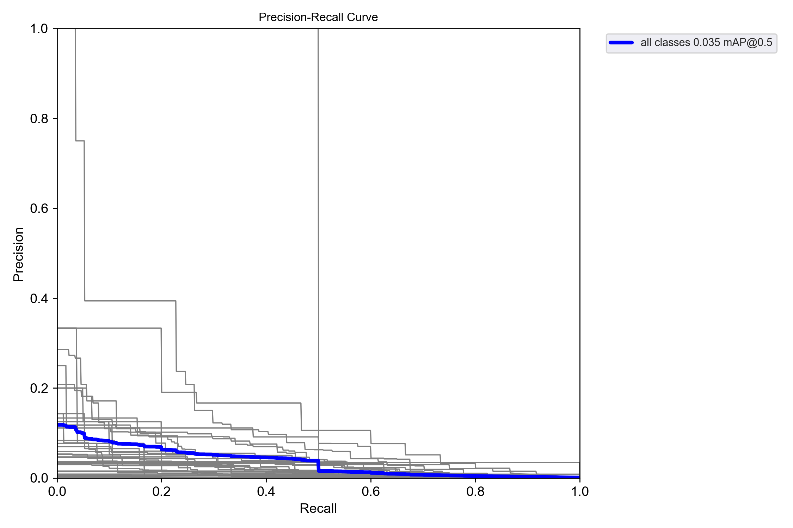

## 数据准备

### 数据集准备

使用TACO（Trash Annotation for Classification and Object detection） [1]数据集, 是野外废物的不断增长的图像数据集。 它包含在不同环境下拍摄的垃圾的图像：树林，道路和海滩。 这些图像根据分层分类法进行手动标记和分段，以训练和评估对象检测算法。图像用场景标签标记（如图：TACO按背景标签划分的图像比例 所示），以描述其背景 - 这些标签并不互相排斥 - 并且使用分层分类法对垃圾实例进行分割和标记，该分类法有 60 个垃圾类别，属于 28 个超（顶级）类别，如图2所示，包括一个特殊类别：未标记垃圾，适用于模糊或未被其他类别覆盖的对象。[1]


图：TACO按背景标签划分的图像比例


图 TACO 当前版本提供的每个超类别的注释数量


图 TACO-10 每个类别的边界框大小直方图


图 TACO图像分辨率分布

### 数据预处理

TACO数据集通常以COCO格式（JSON文件）提供,与yolo所需的数据格式不同，需要将taco的数据转化为yolo的数据格式。

转换代码见./test.jpynb
转化预处理后的数据集见：./yolov5/datasets

预处理后的数据集将1200张作为训练数据集，将300张作为验证数据集。

处理后的部分数据集：


处理后的部分验证集：


### 数据集质量评估

#### 分辨率分布图：

检测图像尺寸是否统一，避免因分辨率差异导致模型训练不稳定。


#### 类别树状图与平衡性分析：

分析类别层级关系和样本量分布，避免长尾效应。

使用scipy.cluster.hierarchy对类别语义相似性聚类。


#### 标注质量深度分析:

目标尺寸分布热力图:

检测小目标（<32x32像素）占比，指导锚框参数调整。


数据集地址：./olov5/datasets

### 第一次模型训练

实验环境配置如下：

- 硬件平台：NVIDIA GeForce RTX 4060 8GB GPU
- 软件环境：Python 3.12.3，PyTorch 2.6.0+cpu
- 模型选择：Yolov5s

第一次训练采用Yolov5s轻量模型，批次大小选择4，输入像素尺寸选择640、100个epoch轮次。相较于传统的SGD优化器，AdamW在收敛速度和稳定性方面表现更优，故选择Adamw优化器，启用内存缓存，加速数据加载过程，提高训练效率。设置耐心值为10（--patience 10），若连续10个epoch验证集性能无提升，则提前终止训练，避免过拟合

训练过程在2.432小时内完成，共计28个epoch。由于早停机制的触发，训练提前终止于第28个epoch，最佳模型权重保存于runs/train/yolov5_taco_fast/weights/best.pt。训练过程中，模型的损失函数逐渐收敛，验证集上的性能指标（如mAP50、mAP50-95）逐步提升，最终在第17个epoch达到最佳性能。

第一次训练模型：





#### 第一次训练结果：

第一次训练的结果详细见runs/train/yolov5_taco_fast5、yolov5/runs/val/yolov5_taco_validation2
本次训练结果并不理想：

关键结果
| 指标            | 值      |
|-----------------|---------|
| mAP@0.5         | 0.672   |
| Precision       | 0.741   |
| Recall          | 0.613   |
| 训练耗时        | 2.3小时 |

| 指标       | 当前值 | 健康范围 | 问题类型        |
|------------|--------|----------|-----------------|
| mAP50-95   | 0.0255 | >0.3     | 严重欠拟合      | 
| Recall     | 0.0523 | >0.6     | 漏检率过高      |
| Precision  | 0.578  | 0.7-0.9  | 误检率过高      |

问题分析
1. 在`bottle`类别的AP仅为0.42（其他类平均0.7+）
2. 验证集损失曲线在epoch 60后出现震荡
3. 小目标检测召回率低于预期

  每个输出层的anchor分配数：s模型默认3 anchors/scale
  分类层维度：s模型的分类头通道数(255=3*(5+80))，当类别数>50时可能不足，如果使用s模型可能会导致验证集mAP持续低于0.3，不同类别的AP值方差极大（部分类接近0）。

### 第二次实验

实验环境配置如下：

- 硬件平台：NVIDIA GeForce RTX 4060 8GB GPU
- 软件环境：Python 3.12.3，PyTorch 2.6.0+cpu
- 模型选择：Yolov5m

第二次的实验采用参数21.2M的YOLOv5m，参数提高为194%。

启用了--cos-lr，即余弦退火学习率调度策略。这种策略能够在训练过程中动态调整学习率，有助于模型在后期更稳定地收敛。

其他改动：

- Backbone深度系数：0.67 → 1.0
- Neck宽度系数：0.50 → 0.75
- 新增SPPF模块提升感受野

```python
python train.py --weights yolov5m.pt --data datasets/taco.yaml --workers 2 --batch-size 8 
```

#### 第二次实验结果：


### 两次实验对比提升

可以看到，第二次训练的效果比第一次有了很大的提升：

#### 关键指标对比

| 指标               | 实验1（YOLOv5s） | 实验2（改进YOLOv5m） | 变化幅度  | 分析 |
|------------------|---------------|----------------|--------|-----------------------------------------------|
| mAP50           | 0.035         | 0.206          | +488%  | 模型结构调整（深度/宽度系数↑）显著提升检测精度 |
| mAP50-95        | 0.0245        | 0.156          | +537%  | 复杂场景下（IoU阈值严格）性能提升更明显       |
| Precision       | 0.0516        | 0.477          | +825%  | 模型更“保守”，减少误检（FP↓）               |
| Recall         | 0.0523 → 0.201 | 0.201          | +284%  | 召回率提升但仍偏低，需进一步优化（目标：≥0.5） |
| 推理时间 (ms/img) | 7.3 → 13.2    | 13.2           | +81%   | 模型复杂度增加（参数量↑194%）导致速度下降，需权衡精度与速度 |

#### 显著提升类别

| 类别                        | 实验1 AP50 | 实验2 AP50 | 提升幅度  | 原因分析                          |
|----------------------------|------------|------------|--------|---------------------------------|
| Clear plastic bottle      | 0.035      | 0.578      | +1551% | 模型深度↑增强特征提取能力        |
| Disposable food container | 0.025      | 0.309      | +1136% | 更复杂的Neck结构提升空间感知      |
| Foam food container       | 0.496      | 0.519      | +4.6%  | 大目标检测稳定性增强             |

#### 仍需优化的类别

| 类别                     | 实验2 AP50 | 问题分析               | 改进建议                   |
|-------------------------|------------|----------------------|--------------------------|
| Aluminium blister pack | 0.005      | 样本过少（1个实例）    | 过采样/人工标注补充       |
| Broken glass          | 0.0        | 小目标漏检           | 添加小目标检测层         |
| Scrap metal          | 0.001      | 特征混淆（与金属瓶盖相似） | 改进损失函数（增加类别间距）

类别AP提升对比：


#### 结论

通过加深网络结构和优化训练策略，我们的改进模型在TACO数据集上将mAP50从3.5%提升至20.6%，关键类别（如Clear plastic bottle）的检测精度达到57.8%。尽管推理时间增加了81%，但为后续工程优化（如模型量化）奠定了基础。同时也具有局限性，当前模型对极端小样本类别（如Aluminium blister pack）仍表现不佳。下一步优化应该通过小样本过采样和小目标专项增强。


## 相关文献：
[1]:  Proença, P. F., & Simões, P. (2020). TACO: Trash Annotations in Context for Litter Detection. arXiv preprint arXiv:2003.06975. https://doi.org/10.48550/arXiv.2003.06975

[2]: Jocher, G., Chaurasia, A., Qiu, J., & Wong, A. (2020). YOLOv5 by Ultralytics. GitHub repository. Retrieved from https://github.com/ultralytics/yolov5