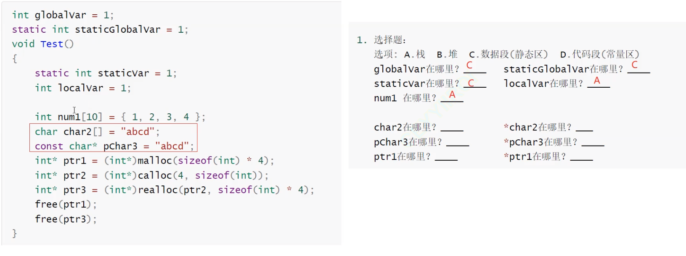

# C++ - 内存分布和模板函数

## C++内存管理概述

### 内存管理的重要性
在C++中，内存管理是一个非常重要的概念，它直接关系到程序的性能和稳定性。良好的内存管理可以：
1. 避免内存泄漏
2. 提高程序运行效率
3. 确保程序稳定性
4. 优化资源利用

### 内存分配方式
C++中的内存分配主要有以下几种方式：
1. 静态分配：在编译时确定大小，如全局变量、静态变量
2. 栈分配：函数内的局部变量，自动分配和释放
3. 堆分配：动态分配，需要手动管理内存

## 内存分布示例题目



通过这道题目可以了解内存分布。

## new/delete详解

### new操作符的工作原理
new操作符的工作过程：
1. 调用operator new分配内存
2. 调用构造函数初始化对象
3. 返回对象指针

```cpp
// new的底层实现原理
void* operator new(size_t size) {
    void* ptr = malloc(size);
    if (ptr == nullptr) {
        throw std::bad_alloc();
    }
    return ptr;
}
```

### new的多种使用方式

1. 基本使用：
```cpp
int* p1 = new int;        // 分配单个int
int* p2 = new int[10];    // 分配int数组
```

2. 定位new（placement new）：
```cpp
char buffer[sizeof(A)];
A* p = new(buffer) A(10);  // 在指定内存位置构造对象
```

3. 带初始化的new：
```cpp
int* p3 = new int(42);    // 分配并初始化为42
```

### delete的正确使用

1. 基本释放：
```cpp
delete p1;        // 释放单个对象
delete[] p2;      // 释放数组
```

2. 注意事项：
- 必须配对使用new和delete
- 数组必须使用delete[]
- 释放后指针应该置空（避免悬空指针）

### new/delete的异常处理

```cpp
try {
    int* p = new int[1000000000];
    // 使用内存
    delete[] p;
} catch (const std::bad_alloc& e) {
    std::cerr << "内存分配失败: " << e.what() << std::endl;
}
```

### malloc/free和new/delete的区别

1. 基本特性：
- malloc和free是函数，new和delete是操作符
- malloc申请的空间不会初始化，new会初始化
- malloc申请空间时需要手动计算大小，new自动计算

2. 类型安全：
- malloc返回void*，需要类型转换
- new直接返回对应类型的指针

3. 异常处理：
- malloc失败返回NULL，需要手动检查
- new失败抛出异常，可以使用try-catch处理

4. 对象处理：
- malloc/free只分配/释放内存
- new/delete会调用构造函数/析构函数

5. 内存对齐：
- new保证内存对齐
- malloc可能需要手动处理对齐

### 内存管理最佳实践

1. 使用智能指针：
```cpp
std::unique_ptr<int> p(new int(42));
std::shared_ptr<int> p2 = std::make_shared<int>(42);
```

2. RAII原则：
```cpp
class ResourceManager {
    int* ptr;
public:
    ResourceManager() : ptr(new int[100]) {}
    ~ResourceManager() { delete[] ptr; }
};
```

3. 避免常见错误：
- 内存泄漏
- 重复释放
- 使用已释放的内存
- 数组越界

## 内存分布补充说明

### 内存分区
C++程序的内存分布主要分为以下几个区域：
1. 栈区（Stack）：存放局部变量、函数参数等
2. 堆区（Heap）：动态分配的内存区域
3. 全局/静态区：存放全局变量、静态变量
4. 常量区：存放字符串常量等
5. 代码区：存放程序的二进制代码

### 内存对齐
在C++中，结构体和类存在内存对齐的问题：
```cpp
struct A {
    char a;     // 1字节
    int b;      // 4字节
    char c;     // 1字节
};
```
由于内存对齐，这个结构体实际占用12字节而不是6字节。

## 模板

### 函数编程

函数模板写的框架：

```cpp
template<typename Type>
void Swap(Type & left,Type & right){
    Type temp = left;
    left = right;
    right = temp;
}
```

模板是定义一种通用的类型，是泛型编程。

上面的模板函数在使用的时候：

```cpp
int a = 0,b = 1;
Swap(a,b);

double c = 1.1,d = 2.2;
Swap(c,d);

int *p1 = &a,*p2 = &b;
Swap(p1,p2);
```

这里不论是int、double还是int*都可以使用这个模板函数进行交换。

这里其实在内存上是调用了三个不同的函数。调用的是编译器用模板生成的函数。

函数模板的原理就是在调用int交换时候，编译器就生成一份int的Swap函数，double也类似。这里就是模板的实例化。

模板的效率并没有明显的提高，但是在使用的时候会更加方便，代码更加清晰容易理解。

如何是下面这样使用：

```cpp
Swap(a,c);
```

这里的a是int类型，c是float类型，无法正常的对模板进行实例化。

解决这种问题可以对c进行类型转化，将double转化为int，也可以对模板进行显示实例化：

```cpp
Swap<double>(a,c);
Swap<int>(a,c);
```

函数模板在推断自己实例化的类型的时候，是需要用传入的参数类型作为依据进行推理。返回值不可以作为推导的依据。

如下面这个例子

```cpp
template<class T>
T * func(int a){
    T*p = (T*)operator new(sizeof(T));
    new(p)T(a);

    return p;
}
```

这里必须使用显示实例化去将模板函数的返回值标明：

```cpp
A* ret = func<A>(1);
```

同名的函数模板和普通函数是可以同时存在的，编译器会自行选择更加匹配的调用使用。

都有的情况，会优先匹配普通函数。

如果没有普通函数，会优先匹配参数匹配+函数模板。

只有一个，类型转化一下

### 类模板

函数模板在实践的过程中使用的情况并不是很多，而类模板使用的次数是更多的。

```cpp
template<class T>
class Stack{
public:
    Stack(size_t capacity = 4){
        _array = (T*)malloc(sizeof(T)* capacity);
        if (nullotr == _array){
            perror("malloc申请空间失败")
            return;
        }
        _capacity = capacity;
        _size = 0;
    }

    void Push(const T& data);

private:
    T *array;
    size_t _capacity;
    size_t _size;
};

template<class T>
void Stack<T>:Push(const T&data){
    _array[_size] = data;
    ++size;
}
```

模板不建议`.c`和`.h`分离到两个文件，会出现链接错误。

## 模板补充说明

### 非类型模板参数
除了类型参数外，模板还可以使用非类型参数：
```cpp
template<class T, size_t N>
class Array {
    T _array[N];
};
```

### 模板特化
当模板无法满足某些特殊类型的需求时，可以使用特化：