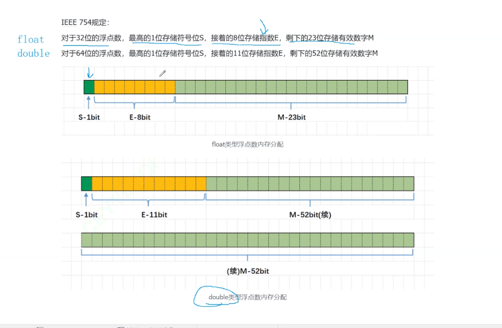

# C复习6-数据在内容中的储存/结构体


## char截断与整型提升
```c
int main()
{
    char a = -1;
    signed char b = -1;
    unsigned char c = -1;
    print("a=%d,b=%d,c=%d",a,b,c);

    return 0;
}
```

这里输出的结果是-1，-1，255

这里的-1存储在a中发生了截断。

第一个和第二个是有符号的char，截断后的`11111111`是-1的补码。
而这里的打印用的是`%d`，是有符号的整数，要对a进行整数提升，按照符号位提升，提升之后就是`11111111111111111111111111111111`取到补码之后就是-1。

第三个是无符号数的整型提升，是高位直接加0，所以变成了正数。

```c
#include <stdo.h>

int main(){
    char a = -128;
    print("%u\n",a);

    return 0;
}
```

这里的%u是十进制的无符号位整数。


将有符号位的char可以想象为一个表盘，在一点钟到六点钟是00000000、00000001~01111111。也就是从0到127。六点钟到12点钟方向是10000000~11111111，也就是从-128到-1.

无符号数是顺时针从0到255.

这里运行的结果是4294967168

说明在进行整型截断的时候，a的值实际上是10000000，在打印的时候要打印无符号整数，便将其前面补1，变成这串奇奇怪怪的数字。

```c
int main(){
    char a = 128;
    printf("%u\n",a);

    return 0;
}
```

这里的128是：00000000000000000000000010000000

在进行整数截断之后变成了：
10000000，这就是a的值。

在输出a的时候产生整型提升，变成11111111111111111111111110000000

所以最后产生的结果和第二光例子是相同的。

```c
int main(){
    char a[1000];
    int i;
    for(i = 0;i < 1000;i++){
        a[i] = -1 - i;
    }
    print("%d",strlen(a));

    return 0;
}
```

这里的返回值是255，因为求字符串的长度是在找到\0的长度，而\0的ASCLL码的值是0，故找到char的值是0就返回了长度。

这里的这个char数组是从-1到-128，再从127到0，故长度是128+127=255

```c
unsigned char i = 0;

int main(){
    for(i = 0;i <= 255;i++){
        print("ads\n);
    }
    return 0;
}
```

无符号char是从0到255，所以这里会恒成立，无限循环。

```c
int main(){
    int a[4] = {1,2,3,4};
    int * ptr1 = (int *)(&a + 1);
    int *ptr2 = (int *)((int)a + 1);

    printf("%x,%x",ptr1[-1],*ptr2);

    return 0;
}
```
ptr1[-1]相当于*(ptr1 - 1),如何按照小端存储，第一个值就是4。

ptr2向后平移了一个字节。

## 浮点数在内存中的存储

```c
int main(){
    int n = 9;
    float *pFloat = (float&*)&n;

    print("n：%d\n",n);

    print("*pFlat:%f\n",*pFloat);

    *pFloat = 9.0;
    printf("n:%d",n);
    printf("*pFloat:%f\n",*pFlaot);

    return 0;
}
```

这里的运行结果是：

```
n:9
*pFloat:0.000000
n:1091567616
*pFloat:9.000000
```

这里可以看出来整型和浮点数在内存中是完全不同的。

浮点数在内存中的存储是更复杂一些的。

浮点数的存储方式是国际组织IEEE规定的。


小数转化为二进制的时候，小数点后面是要符合第一位是2的负一次方，小数点后第二位是2的负二次方。

选择使用三个参数存储：

V = ((-1)^S)*M*2^E



浮点数使用科学计数法存储的，只存储小数点之后的数，用23个位数。

E是8位，为了防止出现负数，要使用一个中间值127，也就是是将真实的E加上127之后存储在这八个bit位中。


在取出浮点数的过程，分位三种情况。

当E不是全零或者全1的时候，将E减去127得到真实的E的值，还原出原来的数字。

当发现E是全0的时候，真实的E是-127，及说明这是一个无穷小的数字。

当发现E为全1的时候，表示的是正负无穷大的数字。

当大致理解浮点数的存储过程，就可以理解上面那个题目了。

有些浮点数在内存中无法精确保存，double类型的精度比float高，两个浮点数比较大小可以存在问题。

所以在比较小数的时候，可以使用精度的方法进行比较。

这种浮点数的存储方式，总会有一些数字无法存储在内存中，只能无限接近。比如99.7。

有时间可以去看一看“深度解析C语言”

## 结构体

结构体的声明：

```c
struce sa{
    int s;
    char d[];
}variable-list;
```

结构是一些值得集合。数组是一些相同类型值得集合，而结构是一些不同类型值得集合。

结构体在初始化的时候，有下面两种初始化方法：

```c
struct sa s1 = {123,"sad"};
struct sa s2 = (.s=123,.d = "sad");
```

如果是匿名的结构体类型：

```c
struct{
    int a;
    int b;
}*p;
```

可以用指针操作。

匿名结构体一般不是很常用。

### 结构体内存对齐

⾸先得掌握结构体的对⻬规则：

结构体的第⼀个成员对⻬到和结构体变量起始位置偏移量为0的地址处
其他成员变量要对⻬到某个数字（对⻬数）的整数倍的地址处。
对

⻬数=编译器默认的⼀个对⻬数与该成员变量⼤⼩的较⼩值。
vs的值为8

Linux中gcc没有默认对⻬数，对⻬数就是成员⾃⾝的⼤⼩

结构体总⼤⼩为最⼤对⻬数（结构体中每个成员变量都有⼀个对⻬数，所有对⻬数中最⼤的）的
整数倍。

如果嵌套了结构体的情况，嵌套的结构体成员对⻬到⾃⼰的成员中最⼤对⻬数的整数倍处，结构
体的整体⼤⼩就是所有最⼤对⻬数（含嵌套结构体中成员的对⻬数）的整数倍。

### 为什么会存在内存对齐：

1. 平台原因：

不是所有的硬件平台都可以访问任意地址上的任意数据；某些硬件平台只能在某些地址处取得特定类型的数据。

2. 性能原因：

数据结构，尤其是栈，尽可能地在自然边界上对齐。

### 修改默认对齐数

修改默认对齐数：

```c
#pragma pack(1)
```

### 结构体传参

因为结构体所占地空间很大，所以在传参地时候，尽量可以传指针，这样可以减少消耗。

### 位段

位段地声明和结构体地声明类似：

```c
struct A
{
    int _a:2;
    int _b:5;
    int _c:10;
    int _d:30;
};
```

位段时在变量后面加上冒号和数字。

位段A在这里开辟了8个字节。有47个比特位。

使用位段一般是特殊场景。如果这里的a取值是0，1，2，3，用不了四个字节，有两个比特位就可以了，就可以按照这种方式。

对齐是用空间换时间，位段是用时间换空间。

位段是如何开辟空间和平台的关系很大，不同平台有不同的开辟空间的方法。

对结构体的位段不能使用&进行取地址。

