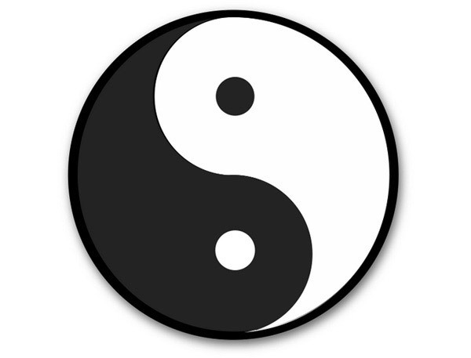

 **Go结构体修仙传：从凡人到飞升，手把手教你修炼九重面向对象大** 

---

### 一、开场白：编程界的"乐高大师"


各位道友，想象一下你面前摆着一盒乐高积木。单独看每块积木平平无奇，但组合起来就能造出飞船、城堡甚至整个城市。Go语言的结构体(struct)就是这样的存在——**没有花里胡哨的语法糖，却能用最简单的积木搭建出最复杂的系统**。

今天咱们不聊那些高深莫测的理论，我把自己当小白鼠，带你们体验一把从结构体小白到宗门长老的修炼之路。准备好瓜子饮料，咱们发车！

---

### 二、第一重：结构体的七十二变

#### 1. 基础人形态：结构体定义

go语言是可以支持中文作为变量名称的。为了方便理解，以及区分变量名称和关键字，下面的大部分变量都是用中文命名的。

```go
type 手机 struct {
    品牌 string
    价格 float64
    电量 int
}

我的手机 := 手机{"菠萝", 5999.0, 100}
```
这里是一个简单的结构体定义与命名，这就好比你去手机店说："老板，给我装个手机！要菠萝牌的，顶配，充满电！"。结构体就是装数据的快递箱，把相关属性打包运输。

#### 2. 影分身之术：值传递 vs 指针传递

在Go语言中，结构体的传递有两种方式：值传递和指针传递。

- **值传递**：复制结构体的所有字段，修改副本不会影响原结构体
- **指针传递**：传递结构体的内存地址，修改原结构体的字段

```go
// 值传递：复印机模式
func 换壳(手机副本 手机) {
    手机副本.品牌 = "香蕉"
}

// 指针传递：乾坤大挪移
func 真换壳(原手机 *手机) {
    原手机.品牌 = "橘子"
}

我的手机 := 手机{"苹果", 9999, 80}
换壳(我的手机)      // 原手机纹丝不动
真换壳(&我的手机)    // 手机变橘子了！
```
  

*值传递就像鸣人的影分身，分身再怎么折腾本体不受影响；指针传递则是直接操控本体，得小心别玩脱了！*

#### 3. 九宫格造物法：创建结构体的N种姿势

下面是三种创建结构体的方法：
- **直接声明**：`var 手机 手机`
- **使用new**：`手机 := new(手机)`
- **使用&**：`手机 := &手机{品牌:"菠萝", 价格:5999, 电量:100}`

```go
// 基础版：拼乐高
手机1 := 手机{"大米", 1999, 50}

// 防手抖版：带标签写法
手机2 := 手机{
    品牌: "华仔",
    价格: 3999,
    电量: 70, // 这个逗号不能少！新手杀手
}

// 土豪版：直接上指针
手机3 := &手机{品牌: "外星人"}
```

三种方法各有优劣，你可以根据实际情况选择合适的方法。

---

### 三、第二重：继承的太极之道



Go的继承哲学深得太极精髓——**以柔克刚，大道至简**。咱们不用public/protected/private这些花架子，直接玩嵌入式开发：

下面是结构体的继承的示例：

```go
type 修真者 struct {
    境界 string
    寿命 int
}

type 剑修 struct {
    修真者          // 继承所有属性
    本命飞剑 string
}

张三 := 剑修{
    修真者: 修真者{"金丹期", 500},
    本命飞剑: "诛仙剑",
}
```

go语言没有各种关键字和保护，只需要将父类的属性直接拿过来，就像继承了父类的所有属性。

这就像：
- 剑修继承了修真者的全部修为（属性和方法）
- 可以自由添加独门绝技（扩展属性）
- 随时能覆盖前辈功法（方法重写）
- 没有门户之见（所有继承都是公开的）

---

### 四、第三重：多态的七十二变

#### 1. 接口的"照妖镜"原理

下面是接口的定义与使用：

这里的`妖怪`接口定义了一个`现原形()`方法，而`狐狸精`和`画皮鬼`都实现了这个方法。

go语言的多态实现没有显示声明，是编译器通过接口的实现自动识别的。

如果之前会C++或者java，会觉得这种多态实现的方式有点奇怪，不太习惯。但如果你是C++或者Java的老司机，你会发现go的接口设计更简洁，更符合直觉。

```go
type 妖怪 interface {
    现原形() string
}

type 狐狸精 struct{}
func (f 狐狸精) 现原形() string { return "毛茸茸的九尾狐" }

type 画皮鬼 struct{}
func (h 画皮鬼) 现原形() string { return "腐烂的骷髅" }

func 捉妖(妖 妖怪) {
    fmt.Println("现形！", 妖.现原形())
}
```
Go的接口就像照妖镜——**不管你是人是鬼，只要能现原形，就是妖怪**。这种"鸭子类型"（长得像鸭子、叫声像鸭子，那就是鸭子）的设计，让代码灵活得像是会凌波微步。

#### 2. 空接口：万法归一

go中的空接口`interface{}`就像一个万能的容器，任何类型的变量都可以塞进去。

而任何的类型，也都是继承的`interface{}`。

```go
func 万物鉴定器(物品 interface{}) {
    switch v := 物品.(type) {
    case int:
        fmt.Println("这是数字：", v)
    case string:
        fmt.Println("这是字符串：", v)
    default:
        fmt.Printf("未知类型：%T\n", v)
    }
}
```
空接口`interface{}`就像修仙界的储物袋，什么都能装。但打开时要小心——可能摸出灵丹，在使用不当的时候也可能摸出毒药！

---

### 五、第四重：反射的偷天换日

#### 1. 类型照妖镜

reflect包提供了运行时反射的能力，让我们可以在运行时查看结构体的内部结构。

其中有三个常用的方法：
- `reflect.TypeOf()`：获取类型信息
- `reflect.ValueOf()`：获取值信息
- `reflect.StructField`：结构体字段信息

```go
import "reflect"

func 查看内存结构(物品 interface{}) {
    t := reflect.TypeOf(物品)
    v := reflect.ValueOf(物品)
    
    fmt.Println("类型:", t.Name())
    fmt.Println("值:", v)
    
    if t.Kind() == reflect.Struct {
        fmt.Println("共有", t.NumField(), "个属性")
        for i := 0; i < t.NumField(); i++ {
            字段 := t.Field(i)
            fmt.Printf("%d. %s 类型:%s 值:%v\n",
                i+1, 字段.Name, 字段.Type, v.Field(i))
        }
    }
}
```
运行结果：
```bash
查看内存结构(手机{"大米",1999,50})
类型: 手机
值: {大米 1999 50}
共有 3 个属性
1. 品牌 类型:string 值:大米
2. 价格 类型:float64 值:1999
3. 电量 类型:int 值:50
```

#### 2. 实战：自动生成API文档
```go
func 生成API文档(结构体 interface{}) {
    t := reflect.TypeOf(结构体)
    
    for i := 0; i < t.NumField(); i++ {
        字段 := t.Field(i)
        json标签 := 字段.Tag.Get("json")
        fmt.Printf("%s -> JSON字段名: %s\n", 字段.Name, json标签)
    }
}

type 用户 struct {
    ID   int    `json:"user_id"`
    Name string `json:"user_name"`
}

生成API文档(用户{})
// 输出：
// ID -> JSON字段名: user_id
// Name -> JSON字段名: user_name
```

---

### 六、第五重：结构体标签的符咒之术


结构体标签就像给属性贴符咒，赋予它们特殊能力：

```go
type 修仙者档案 struct {
    姓名 string `db:"name" json:"user_name" xml:"UserName"`
    境界 string `validate:"required,oneof=筑基 金丹 元婴"`
    年龄 int    `gorm:"column:age;type:int"`
}
```

#### 常用符咒大全：
| 符咒类型 | 作用                 | 示例                          |
|----------|----------------------|-------------------------------|
| json     | JSON序列化           | `json:"fieldName,omitempty"`  |
| gorm     | 数据库映射           | `gorm:"primaryKey;autoIncrement"` |
| validate | 数据验证             | `validate:"required,email"`   |
| xml      | XML编码              | `xml:"name,attr"`             |
| yaml     | YAML编码             | `yaml:"user_name"`            |

---

### 七、第六重：实战渡劫——结构体与JSON的恩怨情仇

```go
package main

import (
    "encoding/json"
    "fmt"
)

type 修仙小说 struct {
    书名   string `json:"title"`
    作者   string `json:"author,omitempty"` // 没作者时不显示
    章节数 int    `json:"chapters,string"` // 数字转字符串
    完结   bool   `json:"-"`
}

func main() {
    小说 := 修仙小说{
        书名: "凡人修仙传",
        章节数: 1000,
        完结:  false,
    }

    // 序列化
    json数据, _ := json.MarshalIndent(小说, "", "  ")
    fmt.Println(string(json数据))

    // 反序列化
    var 新小说 修仙小说
    json.Unmarshal([]byte(`{"title":"斗破苍穹","chapters":"2000"}`), &新小说)
    fmt.Printf("%+v\n", 新小说)
}
```
输出：
```json
{
  "title": "凡人修仙传",
  "chapters": "1000"
}
```
反序列化结果：
```bash
{书名:斗破苍穹 作者: 章节数:2000 完结:false}
```

---

### 八、终极心法：结构体使用的十大法则

1. **命名如起卦**：结构体名用大驼峰，字段用小驼峰
2. **指针需谨慎**：超过3个字段或需要修改本体时再用指针
3. **组合胜继承**：优先用结构体组合而不是多层继承
4. **标签不是注释**：别把业务逻辑写进标签里
5. **空接口是毒药**：能不用就不用，用了要做好类型检查
6. **反射耗修为**：性能敏感处慎用反射
7. **导出要三思**：大写字母开头的字段才是公共的
8. **零值可利用**：比如sync.Mutex不需要初始化
9. **比较要小心**：包含不可比较字段（如map）的结构体不能比较
10. **内存对齐很重要**：合理安排字段顺序节省内存

---

### 九、飞升彩蛋：很容易踩的坑

#### 坑1：循环引用
```go
type 师父 struct {
    徒弟 *徒弟
}

type 徒弟 struct {
    师父 *师父 // 编译报错：undefined: 徒弟
}
```
**解法**：先声明后使用
```go
type 徒弟 struct {
    师父 *师父
}

type 师父 struct {
    徒弟 *徒弟
}
```

#### 坑2：标签字符串
```go
type 错误示例 struct {
    字段 int `json:"name" validate: "required"` // 注意冒号后的空格！
}
```
这个标签实际会被解析为`json:"name" validate: "required"`，正确的应该是：
```go
`json:"name" validate:"required"`
```

---

### 十、结语：结构体的三重天

1. **看山是山**：结构体就是个数据盒子
2. **看山不是山**：结构体是面向对象的根基
3. **看山还是山**：结构体是Go语言哲学的具现化

🛠️ **实战大礼包**：
- [Go by Example: Structs](https://gobyexample.com/structs)
- [官方JSON处理指南](https://golang.org/pkg/encoding/json/)
- [GORM结构体标签大全](https://gorm.io/docs/models.html)


下次面试被问到Go面向对象，记得挺直腰板说："我们Go的struct，那可比类有意思多了！" 