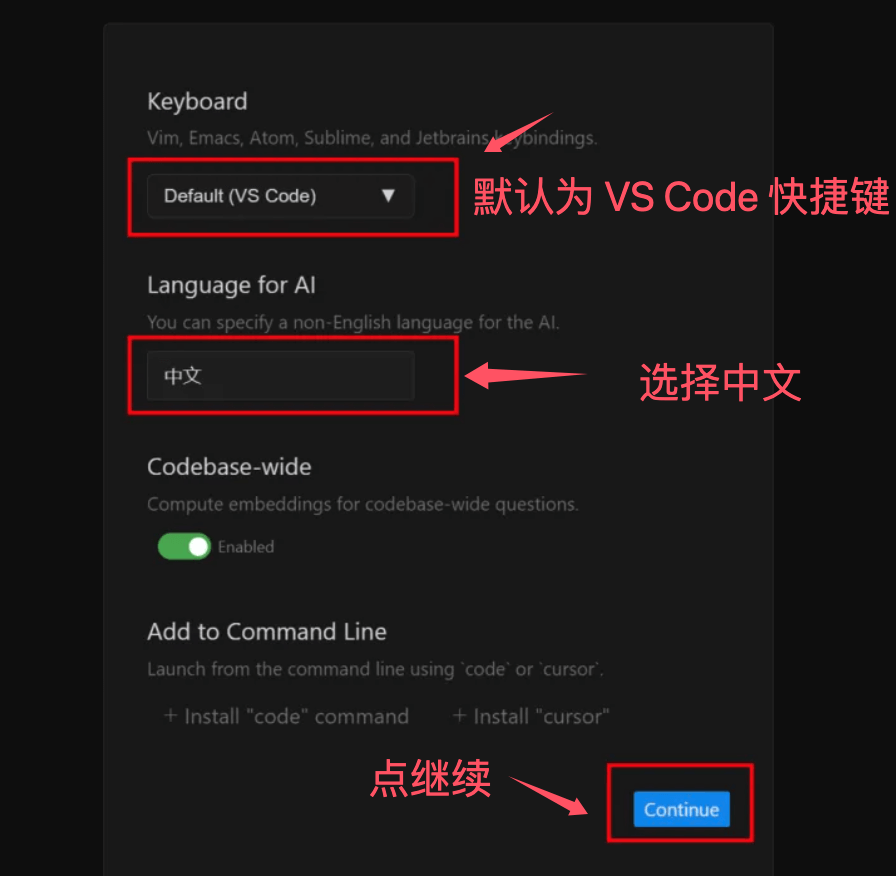
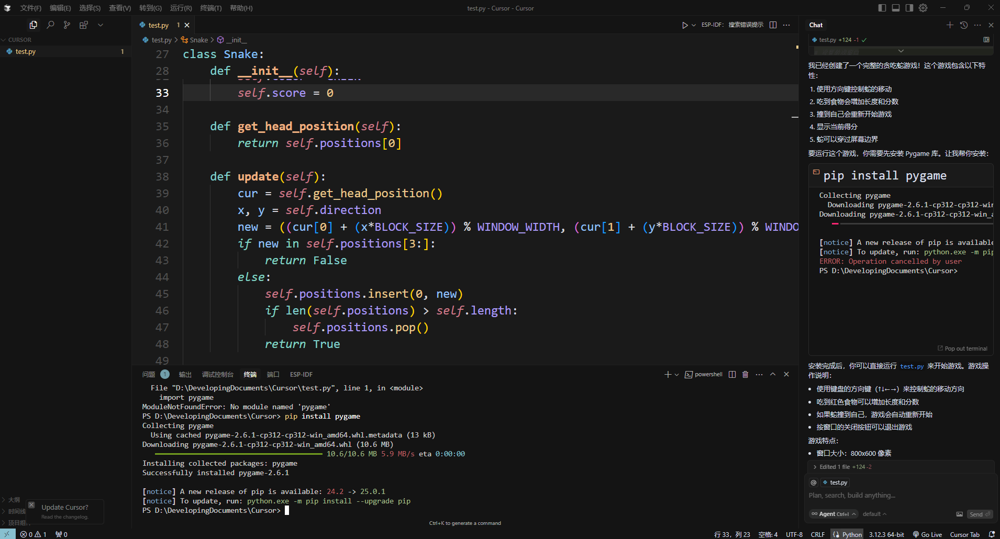

# Cursor入门学习

随着人工智能时代的到来，作为程序员还是会感觉到满满的危机感的，而Cursor、windsurf这样的Ai辅助编程工具，或许很有可能成为未来编程的新范式，及程序员和Ai配合完成代码的编写。

当然，指不定突然冒出来个强大的Agent，完全由Ai编写的代码，就不需要程序员了。

你一定很好奇，为什么Cursor是一个编译器，而不是一个插件，现在可以协助写代码的插件这么多，curosr到底优秀在哪里。

Curosr要做成一款独立的开发工具，而不是做成类似vscode的插件，主要是未来获取编辑器一些很底层的功能，可以更好的和编辑器嵌套在一起。

当然，先抱有疑惑，看看它的功能就明白了。

## Cursor安装

Cursor支持win、linux、mac系统，可以在下面的网址安装：https://www.cursor.com/downloads。

获得需要的安装包后在自己电脑安装。

安装完成之后会弹出一个这样的页面：

这里的第一个选项是选择自己的编程习惯，可以继承一些快捷键之类的。当然，这里我默认使用的是vscode。

第二个选项是选择语言，是和你交互的人工智能所使用的语言，这里直接使用中文就可以了。

可以看到在`continuo`上方有一个`install"curosr"`，推荐选择，不选择也可以。

如果你安装过vscode的话，会跳出一个这样的页面，询问你是否要照搬之前vscode的配置，选不选择都无所谓。

之后正常登录即可。

之后如果有需要的话需要对cursor进行汉化。在插件中所有chinese，找到中文简体的汉化插件就可以。

这里需要注意一点，如果你已经在前面导入了你vscode的汉化插件，并且没有在cursor中显示出来的话，可以先删除汉化扩展，退出软件，重新进入后安装汉化插件，安装完成之后在左下角会弹出一个提示重启的窗口，点击重启即可。

这时候你就可以使用Cursor了。当然，cursor在新用户使用的时候有14天的免费，如果有经济实力支持的话，还是可以支持一下的，毕竟我们都有为好产品付费的理由。

但一个月20美元对于学生党来说还是有些吃力的，所以在最后也有介绍到破解的小方法。

cursor的官方中文文档也写的不错，大家可以参考参考https://cursor.qiannianlu.com/docs/。

## Tab Tab Tab

首先要介绍的是cursor的光标预测功能。cursor通过预测，推理出你下一次想要编辑的位置，并且帮你写好下一次想要编辑的代码，这个时候你只需要按Tab就可以完成编写。

这也是cursor官网上所展示的第一个功能。

程序员有大量的时间其实都是在做简单重复的工作，而tebteb的功能帮助我们可以减少这些重复的工具，非常伟大。

这个功能是被动性的，在使用的过程中自然会体验到它的强大。

## Chat

打开右边的聊天窗口，告诉它帮我们用python制作一个贪吃蛇的游戏，它完成了代码，还询问我们是否要安装pygame库，当我们点击安装之后，就会完成环境和代码。

这里虽然在聊天窗口显示完成了pygame，但是在终端运行的时候还是提示我手动安装库game。

## @引用功能

在聊天窗口中输入@符号的时候，可以唤醒一个输入菜单，菜单中的功能本质上是为了让我们更好的和AI交流。

可以@一块代码，一个文件之类的。也可以将项目中需要的文档链接录入知识库，让ai基于知识库回答。

对于链接文档可以用@，在DOCS中添加链接方便ai引用，对于哪些只用一两次的网址也可以直接@那个网址。

对于一些需要上网查询的信息，cursor也可以直接@web，这个时候会在浏览器中帮你搜索查找相关的内容。

也可以使用@git，将git提交给cursor让帮助寻找差异。

notepad可以作为笔记记录信息，在资源管理器的下部。而@notepad可以将自己的笔记给cursorAi。

@codebase可以将整个文件信息给cursor，需要在Cursor Setting->Features->Codebase indexing中点击Resync index，将数据同步。

这里的索引是不会暴露你的私密信息的，在gitignore中设置需要忽略的信息。

## 全局变量设置

在设置中可以配置cursorai的一些基础功能，比如将其配置为中文，也可以在项目文件中建一个`.cursorrules`的文件，在其中对项目中的cursor进行一些配置，可以描述一下项目的代码规范，技术栈，简介一下项目之类的。

## 放置AI乱改代码

cursor生成的代码可以查看，选择接受或者不接受。点击accept all即可全部接受。

也可以点击save all，先运行一下，看看效果，在效果不错的情况下再选择接受或者拒绝。

cursor也支持回滚，在问答的内容中有一个restore的按钮，点击可以回到这次问答之前的版本。

可以在向ai提问的时候，告诉ai让他复述一遍我的需求再答复，检查ai认为的需求，如果和我们想要的相同，再让他修改代码。

每次让ai修改的内容越少，越具体越好。

## 破解

cursor中在新用户注册之后的，会有14天白嫖。所以只要用不同的邮箱不断注册就好了。

当然，如果你没有这么多的邮箱，可以去临时邮箱平台，用临时邮箱注册。

也可以考虑用无限邮。详细可以自行百度。

最近cursor更新了用户指纹验证，大致就是放置大家邮箱白嫖，一台设备防止多个账户。

这里可以使用脚本，修改本地的cursor。你可以让cursor直接帮你生成一个帮助修改参数的代码，也有别人做好的脚本。

github地址：https://github.com/isboyjc/cursor-reset

我是用的win电脑，可以使用一行命令直接完成修改：

'''
irm https://raw.githubusercontent.com/isboyjc/cursor-reset/main/scripts/reset.ps1 | iex
'''

关于cursor的修改脚本，详细可以看：https://kxcbxprh5yy.feishu.cn/wiki/YG1twgE87i9JoEkUbZdcYPuAn9e